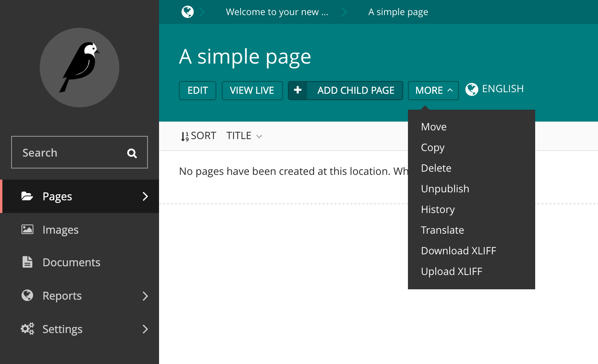
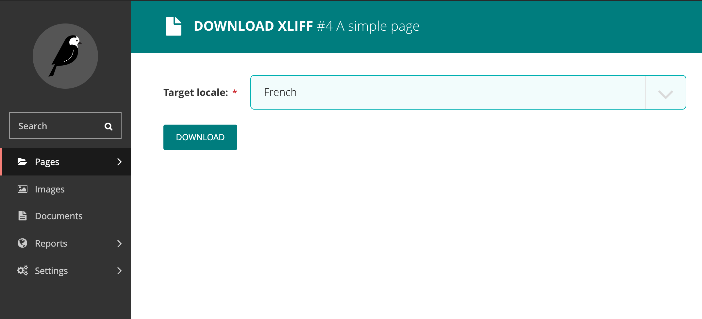
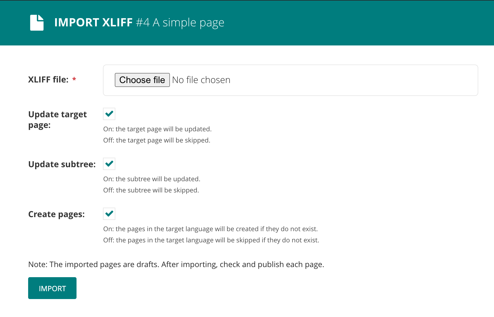
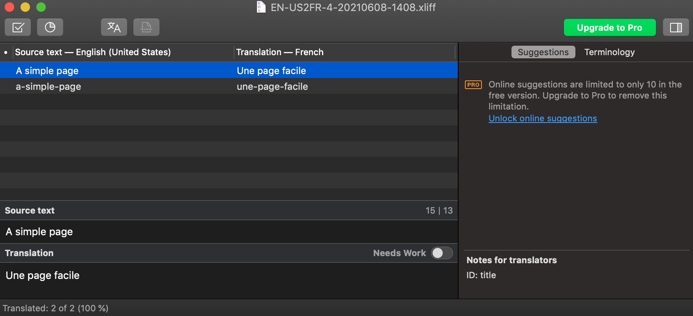

# wagtail-xliff-translation

_Wagtail XLIFF Translation_ is a Wagtail library for converting a Wagtail website to XLIFF (XML Localization Interchange File Format) and back.
It allows translators to work with -XLIFF based- translation software.

Exporting and importing a sub-tree, or a single page is supported.

## Explanation

After successfully adding this package, new routes will be available (e.g. /admin/pages/<page_id>/xliff/download) and pages will have two extra buttons:



Pressing the download button will open the following page, where you can generate and download the XLIFF file:



This will generate an XLIFF file in the following format (page used only has a title):

```xml
<?xml version="1.0" encoding="utf-8"?>
<xliff srcLang="en-us" trgLang="fr" version="2.0"
    xmlns="urn:oasis:names:tc:xliff:document:2.0"
    xmlns:mda="urn:oasis:names:tc:xliff:metadata:2.0"
    xmlns:slr="urn:oasis:names:tc:xliff:sizerestriction:2.0">
    <file id="4_test_app_pagewithrichtext">
        <mda:metadata>
            <mda:metaGroup category="object_nesting">
                <mda:meta type="child">no</mda:meta>
            </mda:metaGroup>
        </mda:metadata>
        <unit canResegment="no" id="title" name="title" slr:sizeRestriction="255" translate="yes" type="local:CharField">
            <segment>
                <source>A simple page</source>
                <target></target>
            </segment>
        </unit>
        <unit canResegment="no" id="slug" name="slug" slr:sizeRestriction="255" translate="yes" type="local:SlugField">
            <segment>
                <source>a-simple-page</source>
                <target></target>
            </segment>
        </unit>
    </file>
</xliff>

```

<b>Note: the source tags contain the content of the original page, the target tags is where the translations go.</b>

Finally, this package provides an upload page with several options:



Uploading can result in errors, for example when the XLIFF file is missing content in the target tags. Wagtail page validation is also done and can also result in errors.

## Editors

The XLIFF file is formatted in such a way it works with XLIFF editors as well, for example [Poedit](https://poedit.net/).



## Documentation

https://fourdigits.github.io/wagtail-xliff-translation/

## Powered by Four Digits

We love code: https://fourdigits.nl/en/
